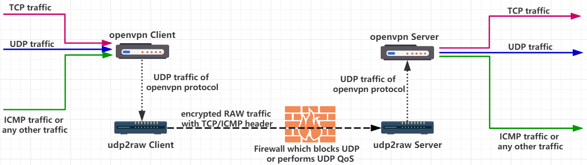
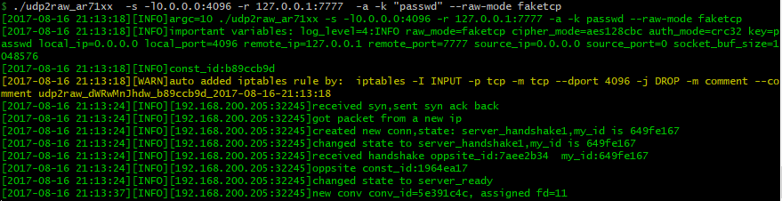
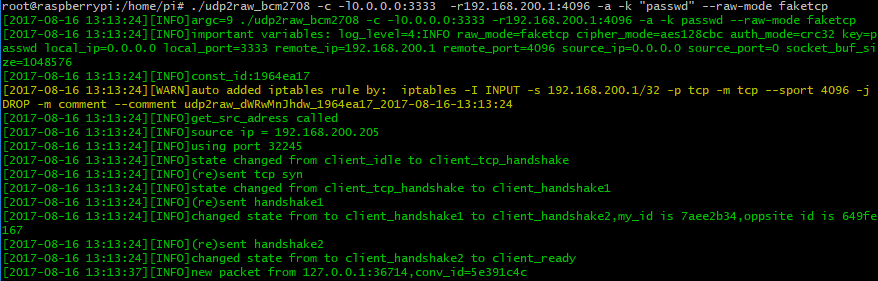

# Udp2raw-tunnel


A Tunnel which turns UDP Traffic into Encrypted FakeTCP/UDP/ICMP Traffic by using Raw Socket, helps you Bypass UDP FireWalls(or Unstable UDP Environment).

When used alone,udp2raw tunnels only UDP traffic. Nevertheless,if you used udp2raw + any UDP-based VPN together,you can tunnel any traffic(include TCP/UDP/ICMP),currently OpenVPN/L2TP/ShadowVPN and [tinyfecVPN](https://github.com/wangyu-/tinyfecVPN) are confirmed to be supported.


or



[udp2raw wiki](https://github.com/wangyu-/udp2raw-tunnel/wiki)

[简体中文](/doc/README.zh-cn.md)(内容更丰富)


# Support Platforms
Linux host (including desktop Linux,Android phone/tablet,OpenWRT router,or Raspberry PI) with root account or cap_net_raw capability.

For Windows and MacOS users, use the udp2raw in [this repo](https://github.com/wangyu-/udp2raw-multiplatform).

# Features
### Send/Receive UDP Packets with ICMP/FakeTCP/UDP headers
ICMP/FakeTCP headers help you bypass UDP blocking, UDP QOS or improper UDP NAT behavior on some ISPs. In ICMP header mode,udp2raw works like an ICMP tunnel.

UDP headers are also supported. In UDP header mode, it behaves just like a normal UDP tunnel, and you can just make use of the other features (such as encryption, anti-replay, or connection stalization).

### Simulated TCP with Real-time/Out-of-Order Delivery
In FakeTCP header mode,udp2raw simulates 3-way handshake while establishing a connection,simulates seq and ack_seq while data transferring. It also simulates a few TCP options such as: `MSS`, `sackOk`, `TS`, `TS_ack`, `wscale`. Firewalls will regard FakeTCP as a TCP connection, but its essentially UDP: it supports real-time/out-of-order delivery(just as normal UDP does), no congestion control or re-transmission. So there wont be any TCP over TCP problem when using OpenVPN.

### Encryption, Anti-Replay
* Encrypt your traffic with AES-128-CBC.
* Protect data integrity by HMAC-SHA1 (or weaker MD5/CRC32).
* Defense replay attack with anti-replay window.

[Notes on encryption](https://github.com/wangyu-/udp2raw-tunnel/wiki/Notes-on-encryption)

### Failure Dectection & Stablization (Connection Recovery)
Conection failures are detected by heartbeats. If timed-out, client will automatically change port number and reconnect. If reconnection is successful, the previous connection will be recovered, and all existing UDP conversations will stay vaild.

For example, if you use udp2raw + OpenVPN, OpenVPN won't lose connection after any reconnect, **even if network cable is re-plugged or WiFi access point is changed**.

### Other Features
* **Multiplexing** One client can handle multiple UDP connections, all of which share the same raw connection.

* **Multiple Clients** One server can have multiple clients.

* **NAT Support** All of the 3 modes work in NAT environments.

* **OpenVZ Support** Tested on BandwagonHost VPS.

* **Easy to Build** No dependencies.To cross-compile udp2raw,all you need to do is just to download a toolchain,modify makefile to point at the toolchain,run `make cross` then everything is done.(Note:Pre-compiled binaries for Desktop,RaspberryPi,Android,some Openwrt Routers are already included in [Releases](https://github.com/wangyu-/udp2raw-tunnel/releases))

### Keywords
`Bypass UDP QoS` `Bypass UDP Blocking` `Bypass OpenVPN TCP over TCP problem` `OpenVPN over ICMP` `UDP to ICMP tunnel` `UDP to TCP tunnel` `UDP over ICMP` `UDP over TCP`

# Getting Started
### Installing
Download binary release from https://github.com/wangyu-/udp2raw-tunnel/releases

### Running
Assume your UDP is blocked or being QOS-ed or just poorly supported. Assume your server ip is 44.55.66.77, you have a service listening on udp port 7777.

```bash
# Run at server side:
./udp2raw_amd64 -s -l0.0.0.0:4096 -r 127.0.0.1:7777    -k "passwd" --raw-mode faketcp -a

# Run at client side
./udp2raw_amd64 -c -l0.0.0.0:3333  -r44.55.66.77:4096  -k "passwd" --raw-mode faketcp -a
```
(The above commands need to be run as root. For better security, with some extra steps, you can run udp2raw as non-root. Check [this link](https://github.com/wangyu-/udp2raw-tunnel/wiki/run-udp2raw-as-non-root) for more info  )

###### Server Output:

###### Client Output:


Now,an encrypted raw tunnel has been established between client and server through TCP port 4096. Connecting to UDP port 3333 at the client side is equivalent to connecting to port 7777 at the server side. No UDP traffic will be exposed.

### Note
To run on Android, check [Android_Guide](/doc/android_guide.md)

`-a` option automatically adds an iptables rule (or a few iptables rules) for you, udp2raw relys on this iptables rule to work stably. Be aware you dont forget `-a` (its a common mistake). If you dont want udp2raw to add iptables rule automatically, you can add it manually(take a look at `-g` option) and omit `-a`.


# Advanced Topic
### Usage
```
udp2raw-tunnel
git version:6e1df4b39f    build date:Oct 24 2017 09:21:15
repository: https://github.com/wangyu-/udp2raw-tunnel

usage:
    run as client : ./this_program -c -l local_listen_ip:local_port -r server_address:server_port  [options]
    run as server : ./this_program -s -l server_listen_ip:server_port -r remote_address:remote_port  [options]

common options,these options must be same on both side:
    --raw-mode            <string>        avaliable values:faketcp(default),udp,icmp
    -k,--key              <string>        password to gen symetric key,default:"secret key"
    --cipher-mode         <string>        avaliable values:aes128cbc(default),xor,none
    --auth-mode           <string>        avaliable values:hmac_sha1,md5(default),crc32,simple,none
    -a,--auto-rule                        auto add (and delete) iptables rule
    -g,--gen-rule                         generate iptables rule then exit,so that you can copy and
                                          add it manually.overrides -a
    --disable-anti-replay                 disable anti-replay,not suggested
client options:
    --source-ip           <ip>            force source-ip for raw socket
    --source-port         <port>          force source-port for raw socket,tcp/udp only
                                          this option disables port changing while re-connecting
other options:
    --conf-file           <string>        read options from a configuration file instead of command line.
                                          check example.conf in repo for format
    --fifo                <string>        use a fifo(named pipe) for sending commands to the running program,
                                          check readme.md in repository for supported commands.
    --log-level           <number>        0:never    1:fatal   2:error   3:warn
                                          4:info (default)     5:debug   6:trace
    --log-position                        enable file name,function name,line number in log
    --disable-color                       disable log color
    --disable-bpf                         disable the kernel space filter,most time its not necessary
                                          unless you suspect there is a bug
    --sock-buf            <number>        buf size for socket,>=10 and <=10240,unit:kbyte,default:1024
    --force-sock-buf                      bypass system limitation while setting sock-buf
    --seq-mode            <number>        seq increase mode for faketcp:
                                          0:static header,do not increase seq and ack_seq
                                          1:increase seq for every packet,simply ack last seq
                                          2:increase seq randomly, about every 3 packets,simply ack last seq
                                          3:simulate an almost real seq/ack procedure(default)
                                          4:similiar to 3,but do not consider TCP Option Window_Scale,
                                          maybe useful when firewall doesnt support TCP Option
    --lower-level         <string>        send packets at OSI level 2, format:'if_name#dest_mac_adress'
                                          ie:'eth0#00:23:45:67:89:b9'.or try '--lower-level auto' to obtain
                                          the parameter automatically,specify it manually if 'auto' failed
    --gen-add                             generate iptables rule and add it permanently,then exit.overrides -g
    --keep-rule                           monitor iptables and auto re-add if necessary.implys -a
    --clear                               clear any iptables rules added by this program.overrides everything
    -h,--help                             print this help message

```

### Iptables rules,`-a` and `-g`
This program sends packets via raw socket. In FakeTCP mode, Linux kernel TCP packet processing has to be blocked by a iptables rule on both sides, otherwise the kernel will automatically send RST for an unrecongized TCP packet and you will sustain from stability / peformance problems. You can use `-a` option to let the program automatically add / delete iptables rule on start / exit. You can also use the `-g` option to generate iptables rule and add it manually.

### `--cipher-mode` and `--auth-mode`
It is suggested to use `aes128cbc` + `hmac_sha1` to obtain maximum security. If you want to run the program on a router, you can try `xor` + `simple`, which can fool packet inspection by firewalls the most of time, but it cannot protect you from serious attacks. Mode none is only for debugging purpose. It is not recommended to set the cipher-mode or auth-mode to none.

### `--seq-mode`
The FakeTCP mode does not behave 100% like a real tcp connection. ISPs may be able to distinguish the simulated tcp traffic from the real TCP traffic (though it's costly). seq-mode can help you change the seq increase behavior slightly. If you experience connection problems, try to change the value.

### `--lower-level`
`--lower-level` allows you to send packet at OSI level 2(link level),so that you can bypass any local iptables rules. If you have a complicated iptables rules which conflicts with udp2raw and you cant(or too lazy to) edit the iptables rules,`--lower-level` can be very useful. Try `--lower-level auto` to auto detect the parameters,you can specify it manually if `auto` fails.

Manual format `if_name#dest_mac_adress`,ie:`eth0#00:23:45:67:89:b9`.

### `--keep-rule`
Monitor iptables and auto re-add iptables rules(for blocking kernel tcp processing) if necessary.Especially useful when iptables rules may be cleared by other programs(for example,if you are using openwrt,everytime you changed and commited a setting,iptables rule may be cleared and re-constructed).

### `--conf-file`

You can also load options from a configuration file in order to keep secrets away from `ps` command.

For example, rewrite the options for the above `server` example (in Getting Started section) into configuration file:

`server.conf`

```
-s
# You can add comments like this
# Comments MUST occupy an entire line
# Or they will not work as expected
# Listen address
-l 0.0.0.0:4096
# Remote address
-r 127.0.0.1:7777
-a
-k passwd
--raw-mode faketcp
```

Pay attention to the `-k` parameter: In command line mode the quotes around the password will be removed by shell. In configuration files we do not remove quotes.

Then start the server with

```bash
./udp2raw_amd64 --conf-file server.conf
```

### `--fifo`
Use a fifo(named pipe) for sending commands to the running program. For example `--fifo fifo.file`.

At client side,you can use `echo reconnect >fifo.file` to force client to reconnect.Currently no command has been implemented for server.

# Peformance Test
#### Test method:
iperf3 TCP via OpenVPN + udp2raw
(iperf3 UDP mode is not used because of a bug mentioned in this issue: https://github.com/esnet/iperf/issues/296 . Instead, we package the TCP traffic into UDP by OpenVPN to test the performance. Read [Application](https://github.com/wangyu-/udp2raw-tunnel#application) for details.

#### iperf3 command:
```
iperf3 -c 10.222.2.1 -P40
iperf3 -c 10.222.2.1 -P40 -R
```
#### Environments
* **Client** Vultr $2.5/monthly plan (single core 2.4GHz cpu, 512MB RAM, Tokyo, Japan)
* **Server** BandwagonHost $3.99/annually plan (single core 2.0GHz cpu, 128MB RAM, Los Angeles, USA)

### Test1
raw_mode: faketcp  cipher_mode: xor  auth_mode: simple


(reverse speed was simliar and not uploaded)

### Test2
raw_mode: faketcp  cipher_mode: aes128cbc  auth_mode: md5


(reverse speed was simliar and not uploaded)

# wiki

Check wiki for more info:

https://github.com/wangyu-/udp2raw-tunnel/wiki
