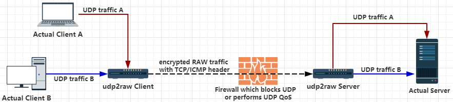
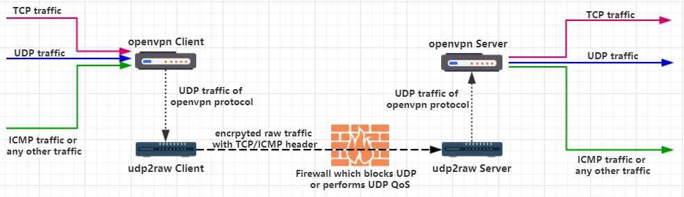

# Udp2raw-tunnel


A UDP Tunnel which tunnels UDP via FakeTCP/UDP/ICMP Traffic by using Raw Socket,helps you Bypass UDP FireWalls(or Unstable UDP Environment).Its Encrpyted,Anti-Replay and Multiplexed.It aslo acts as a Connection Stablizer.

[简体中文](/doc/README.zh-cn.md)
# Features 
### Send / Receive UDP Packet with fake-tcp/icmp headers
Fake-tcp/icmp headers help you bypass UDP blocking, UDP QOS or improper UDP NAT behavior on some ISPs. Raw packets with UDP headers are also supported.In UDP header mode,it behaves just like a normal UDP tunnel,and you can just make use of the other features.

### Simulate TCP Handshake
Simulates the 3-way handshake, along with seq and ack_seq. TCP options MSS, sackOk, TS, TS_ack, wscale are also simulated. Real-time delivery guaranteed, no TCP over TCP problem when using OpenVPN.

### Encrpytion, Anti-Replay, No MITM
* Encrypt your traffic with AES-128-CBC.
* Protect data integrity by MD5 or CRC32.
* Defense replay attack with an anti-replay window, smiliar to IPSec and OpenVPN. 
* Authenticate mutually, no MITM attacks.

### Failure Dectection & Stablization (Connection Recovery)
Conection failures are detected by heartbeats. If timed-out,client will automatically change port number and reconnect. If reconnection is successful, the previous connection will be recovered, and all existing UDP conversations will stay vaild. 

For example, if you use UDP2RAW + OpenVPN, OpenVPN won't lose connection after any reconnect, **even if the network cable is re-plugged or the WiFi access point is changed**.

### Other Features
* **Multiplexing** One client can handle multiple UDP connections, all of which share the same raw connection.

* **Multiple Clients** One server can have multiple clients.

* **NAT Support** All of the 3 modes work in NAT environments.

* **OpenVZ Support** Tested on BandwagonHost.

* **OpenWRT Support** No dependencies, easy to build. Binary for ar71xx are included in release.

### Keywords
* UDP QoS Bypass
* UDP Blocking Bypass
* OpenVPN TCP over TCP problem
* OpenVPN over ICMP
* UDP to ICMP tunnel
* UDP to TCP tunnel
* UDP over ICMP
* UDP over TCP

# Getting Started
### Prerequisites
A Linux host (including desktop Linux, OpenWRT router, or Raspberry PI) with root access.

If you want to use it on MICRO$OFT Windows, you can use VMware or Hyper-V (both bridged mode and <del>NAT mode</del> are supported).

### Installing
Download binary release from https://github.com/wangyu-/udp2raw-tunnel/releases

### Running 
Assume your UDP is blocked or being QOS-ed or just poorly supported. Assume your server ip is 44.55.66.77, you have a service listening on udp port 7777.

```bash
# Run at client side
./udp2raw_amd64 -c -l0.0.0.0:3333  -r44.55.66.77:4096 -a -k "passwd" --raw-mode faketcp

# Run at server side:
./udp2raw_amd64 -s -l0.0.0.0:4096 -r 127.0.0.1:7777  -a -k "passwd" --raw-mode faketcp
```

Now,an encrypted raw tunnel has been established between client and server through TCP port 4096. Connecting to UDP port 3333 at the client side is equivalent to connecting to port 7777 at the server side. No UDP traffic will be exposed.

# Advanced Topic
### Usage
```
udp2raw-tunnel
version: Aug  5 2017 21:03:54
repository: https://github.com/wangyu-/udp2raw-tunnel

usage:
    run as client : ./this_program -c -l local_listen_ip:local_port -r server_ip:server_port  [options]
    run as server : ./this_program -s -l server_listen_ip:server_port -r remote_ip:remote_port  [options]

common options,these options must be same on both side:
    --raw-mode            <string>        avaliable values:faketcp(default),udp,icmp
    -k,--key              <string>        password to gen symetric key,default:"secret key"
    --auth-mode           <string>        avaliable values:aes128cbc(default),xor,none
    --cipher-mode         <string>        avaliable values:md5(default),crc32,simple,none
    -a,--auto-rule                        auto add (and delete) iptables rule
    -g,--gen-rule                         generate iptables rule then exit
    --disable-anti-replay                 disable anti-replay,not suggested
client options:
    --source-ip           <ip>            force source-ip for raw socket
    --source-port         <port>          force source-port for raw socket,tcp/udp only
                                          this option disables port changing while re-connecting
other options:
    --log-level           <number>        0:never    1:fatal   2:error   3:warn 
                                          4:info (default)     5:debug   6:trace
    --log-position                        enable file name,function name,line number in log
    --disable-color                       disable log color
    --disable-bpf                         disable the kernel space filter,most time its not necessary
                                          unless you suspect there is a bug
    --sock-buf            <number>        buf size for socket,>=10 and <=10240,unit:kbyte,default:1024
    --seqmode             <number>        seq increase mode for faketcp:
                                          0:dont increase
                                          1:increase every packet
                                          2:increase randomly, about every 3 packets (default)
    -h,--help                             print this help message
```

### IPTABLES rule
This program sends packets via raw socket. In FakeTCP mode, Linux kernel TCP packet processing has to be blocked by a iptables rule on both sides, otherwise the kernel will automatically send RST for an unrecongized TCP packet and you will sustain from stability / peformance problems. You can use `-a` option to let the program automatically add / delete iptables rule on start / exit. You can also use the `-g` option to generate iptables rule and add it manually.

### `cipher-mode` and `auth-mode` 
It is suggested to use `aes128cbc` + `md5` to obtain maximum security. If you want to run the program on a router, you can try `xor` + `simple`, which can fool packet inspection by firewalls the most of time, but it cannot protect you from serious attacks. Mode none is only for debugging purpose. It is not recommended to set the cipher-mode or auth-mode to none.

### seq-mode
The FakeTCP mode does not behave 100% like a real tcp connection. ISPs may be able to distinguish the simulated tcp traffic from the real TCP traffic (though it's costly). seq-mode can help you change the seq increase behavior slightly. If you experience connection problems, try to change the value. 

# Peformance Test
#### Test method:
iperf3 TCP via OpenVPN + udp2raw 
(iperf3 UDP mode is not used because of a bug mentioned in this issue: https://github.com/esnet/iperf/issues/296 . Instead, we package the TCP traffic into UDP by OpenVPN to test the performance. Read [Application](https://github.com/wangyu-/udp2raw-tunnel#application) for details.

#### iperf3 command: 
```
iperf3 -c 10.222.2.1 -P40 
iperf3 -c 10.222.2.1 -P40 -R
```
#### Environments
* **Client** Vultr $2.5/monthly plan (single core 2.4GHz cpu, 512MB RAM, Tokyo, Japan)
* **Server** BandwagonHost $3.99/annually plan (single core 2.0GHz cpu, 128MB RAM, Los Angeles, USA)

### Test1
raw_mode: faketcp  cipher_mode: xor  auth_mode: simple


(reverse speed was simliar and not uploaded)

### Test2
raw_mode: faketcp  cipher_mode: aes128cbc  auth_mode: md5


(reverse speed was simliar and not uploaded)

# Application
### tunneling any traffic via raw traffic by using udp2raw +openvpn

1. bypasses UDP block/UDP QOS

2. no TCP ovr tcp problem (tcp over tcp problem http://sites.inka.de/bigred/devel/tcp-tcp.html ,https://community.openvpn.net/openvpn/ticket/2 )

3. openvpn over icmp also becomes a choice

more details at [openvpn+udp2raw_guide](/doc/openvpn_guide.md)
### speed-up tcp connection via raw traffic by using udp2raw+kcptun
kcptun is a tcp connection speed-up program,it speeds-up tcp connection by using kcp protocol on-top of udp.by using udp2raw,you can use kcptun while udp is QoSed or blocked.
(kcptun, https://github.com/xtaci/kcptun)

### speed-up tcp connection via raw traffic by using udp2raw+finalspeed
finalspeed is a tcp connection speed-up program similiar to kcptun,it speeds-up tcp connection by using kcp protocol on-top of udp or tcp.but its tcp mode doesnt support openvz,you can bypass this problem if you use udp2raw+finalspeed together,and icmp mode also becomes avaliable.

# How to build
read [build_guide](/doc/build_guide.md)

# Other
### Easier installation on ArchLinux
```
yaourt -S udp2raw-tunnel # or
pacaur -S udp2raw-tunnel
```

# Related work
### kcptun-raw
udp2raw was inspired by kcptun-raw,which modified kcptun to support tcp mode.

https://github.com/Chion82/kcptun-raw
### relayRawSocket
kcptun-raw was inspired by relayRawSocket. A simple  udp to raw tunnel,wrote in python

https://github.com/linhua55/some_kcptun_tools/tree/master/relayRawSocket
### kcpraw
another project of kcptun with tcp mode

https://github.com/ccsexyz/kcpraw

### icmptunnel
Transparently tunnel your IP traffic through ICMP echo and reply packets.

https://github.com/DhavalKapil/icmptunnel

### Tcp Minion
Tcp Minion is a project which modifid the code of tcp stack in kernel,and implemented real-time out-order udp packet delivery through this modified tcp stack.I failed to find the implementation,but there are some papers avaliable:

https://arxiv.org/abs/1103.0463

http://korz.cs.yale.edu/2009/tng/papers/pfldnet10.pdf

https://pdfs.semanticscholar.org/9e6f/e2306f4385b4eb5416d1fcab16e9361d6ba3.pdf
