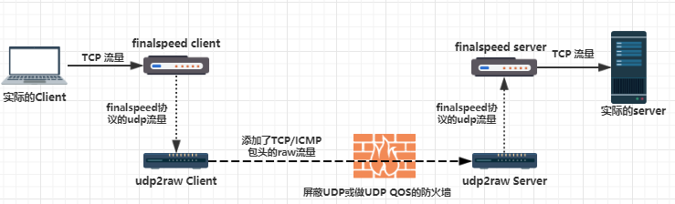
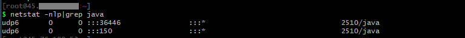
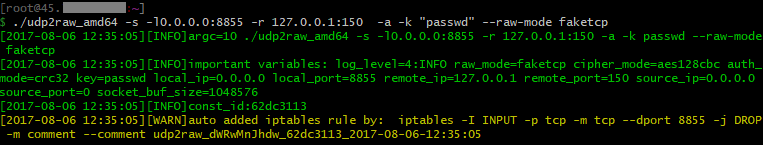
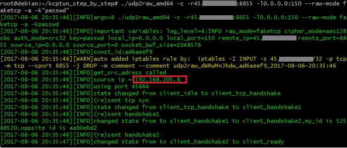
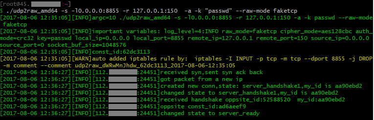
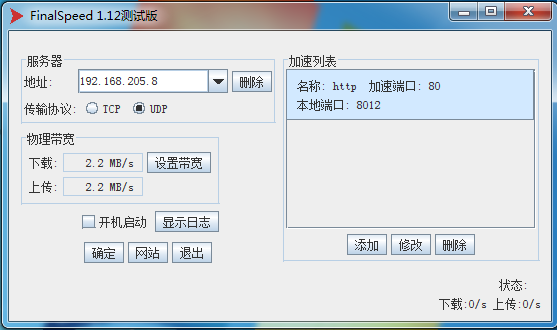
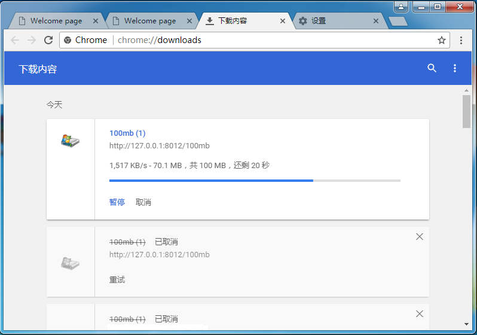
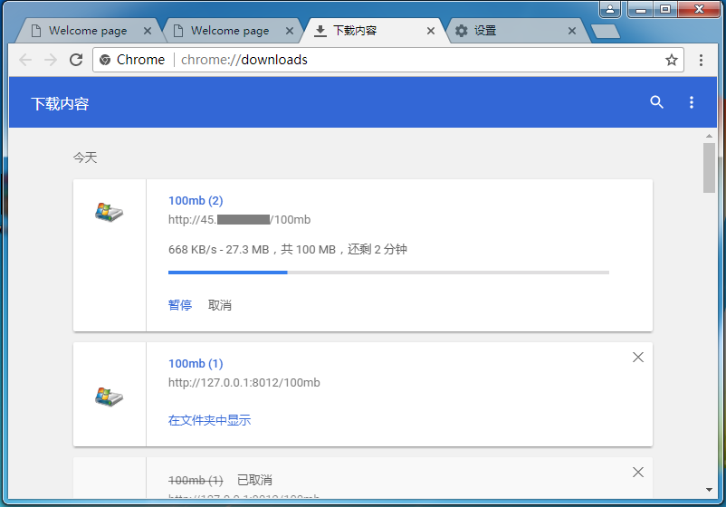

# udp2raw+finalspeed 加速tcp流量 Step by Step 教程


##### 背景
国内有些ISP会对UDP做QOS或屏蔽，这时候加速协议对TCP发包模式的支持就很重要。finalspeed虽然本身支持在底层用TCP发包，但是其依赖的libpcap不支持openvz架构，即使不是openvz架构的主机，也存在不稳定的问题。


##### 摘要
udp2raw是一个把udp流量通过raw socket包装成tcp流量的工具。通过用udp2raw配合udp模式的 finalspeed一样可以达到在底层发tcp包，绕过QOS的效果。支持openvz,稳定性也好很多。原理上相当于在finalspeed外面再包了一层tunnel。

本教程会一步一步演示用udp2raw+kcptun加速http流量的过程。加速任何其他tcp流量也一样。

udp2raw也支持把udp流量包装成Icmp发送，本教程不做演示。

### 环境要求
服务器主机是linux，有root权限。  可以是openvz架构的vps。 也可以是openwrt路由器。

本地主机是windows,安装了wmware,安装了linux虚拟机（网卡设置为桥接模式）。

(如果嫌给虚拟机安装linux麻烦，可以下载别人提供好的linux虚拟机镜像，比如https://www.kali.org/downloads/ ，不过我没有测试过这个镜像,我用的是debian 7)

### 安装
下载好udp2raw的压缩包，解压分别解压到服务器和本地的虚拟机。

https://github.com/xtaci/kcptun/releases

在服务器端安装好finalspeed服务端，在本地windows安装好finalspeed的客户端。服务端我以前是用91yun的一键安装脚本安装的，没装过的可以去网上搜一键安装脚本。

### 运行
1.先在服务器主机运行如下命令，确定finalspeed服务端已经正常启动了。

```
netstat -nlp|grep java
```


如果显示了150端口，就表示服务端启动好了。

2.在服务器启动udp2raw server
```
 ./udp2raw_amd64 -s -l0.0.0.0:8855 -r 127.0.0.1:150  -a -k "passwd" --raw-mode faketcp
```


3.在本地的虚拟机上启动udp2raw client  ,假设服务器ip是45.66.77.88
```
./udp2raw_amd64 -c -r45.66.77.88:8855 -l0.0.0.0:150 --raw-mode faketcp -a -k"passwd"
```
如果一切正常，client端会显示client_ready:



记下红框中的ip,这是虚拟机的网卡ip

在server端也会显示server_reay


4.在本地windows,按图配置好finalspeed的客户端。注意，192.168.205.8改成你刚才记下来的IP，带宽也要按实际的填。传输协议要选UDP.


5.所有准备工作已经完成了，在本地访问本地的8012端口，相当于访问服务器的80端口。

来试一下通过http://127.0.0.1:8012/ 下载文件 ，1.5M/s：


再试一下直接通过服务器的ip访问，http://45.66.77.88:80/ ，速度只有600K/s


教程就到这里了，用来加速其他的tcp服务也是一样的，只要再第三步那里设置其他的端口。
