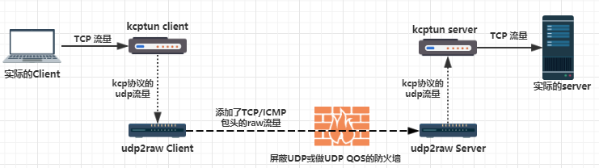
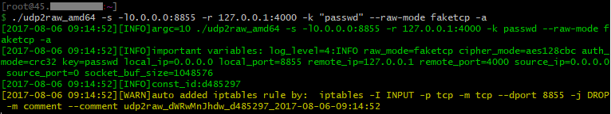
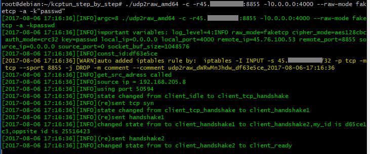
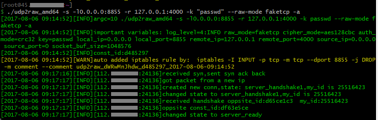
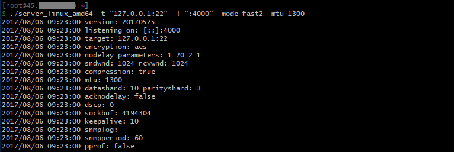
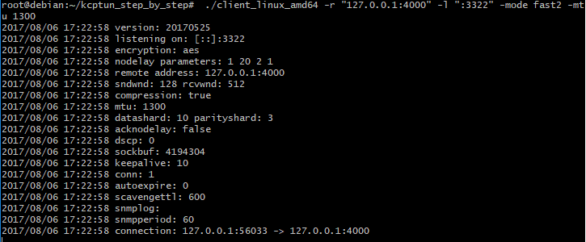
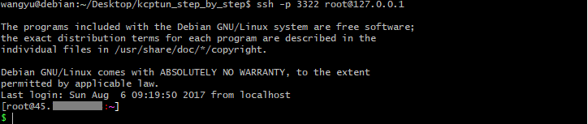

# udp2raw+kcptun 加速tcp流量 Step by Step 教程


本教程会一步一步演示用udp2raw+kcptun加速SSH流量的过程。加速任何其他tcp流量也一样。

### 环境要求
两边的主机都是linux，有root权限。 （windows上桥接模式的虚拟机可用）


### 安装
下载好kcptun和udp2raw的压缩包，解压分别解压到client端和server端。

https://github.com/xtaci/kcptun/releases
https://github.com/wangyu-/udp2raw-tunnel/releases

解压好后，如图：


### 运行
1.在远程服务器运行 udp2raw_amd64 server模式：
```
./udp2raw_amd64 -s -l0.0.0.0:8855 -r 127.0.0.1:4000 -k "passwd" --raw-mode faketcp -a
```


2.在本地运行udp2raw_amd64 client模式，假设server ip是45.66.77.88：
```
./udp2raw_amd64 -c -r45.66.77.88:8855 -l0.0.0.0:4000 --raw-mode faketcp -a -k"passwd"
```
如果一切正常client端输出如下，显示client_ready：


server端也会有类似输出,显示server_ready：


3.在远程服务器运行 kcp server


```
./server_linux_amd64 -t "127.0.0.1:22" -l ":4000" -mode fast2 -mtu 1300
```
-mtu 1300很重要，或者设置成更小。


4.在本地运行 


```
 ./client_linux_amd64 -r "127.0.0.1:4000" -l ":3322" -mode fast2 -mtu 1300
```
-mtu 1300很重要，或者设置成更小。


5.所有准备工作已经做好，在本地运行
```
ssh -p 3322 root@127.0.0.1
```
已经连进去了，而且是经过kcptun加速的：

